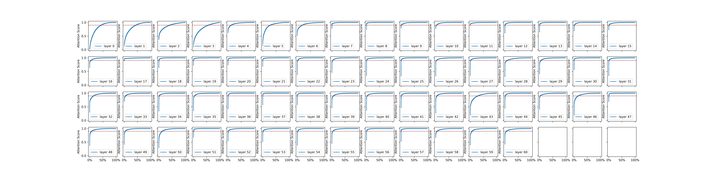
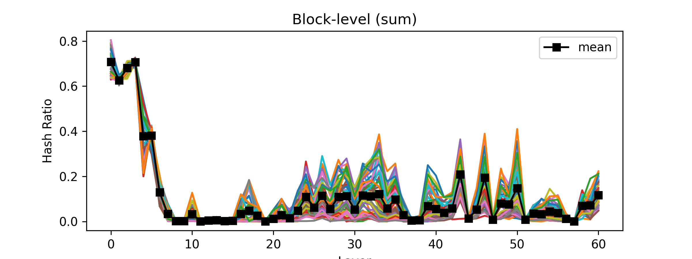
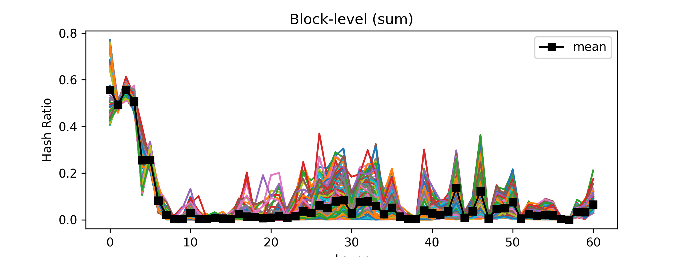
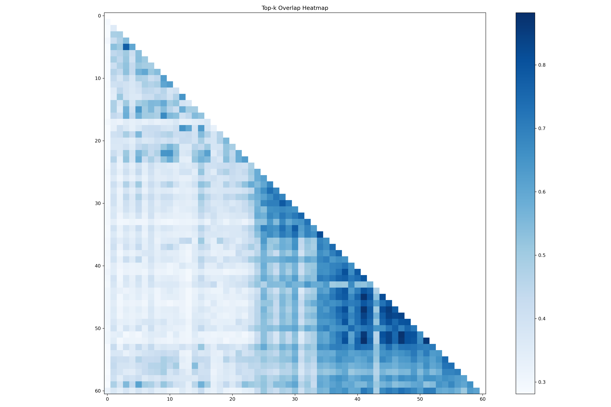
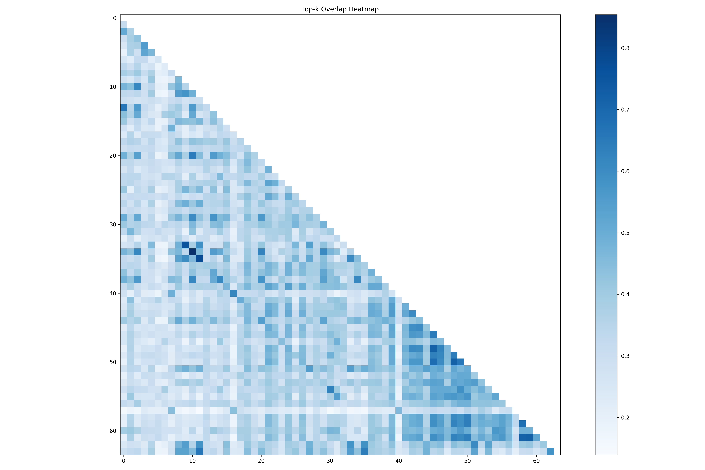
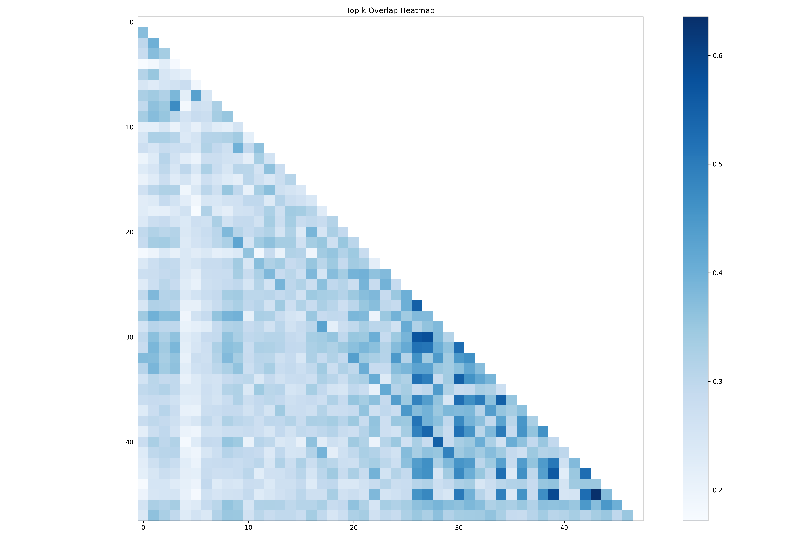

  <picture>
    <source media="(prefers-color-scheme: dark)" srcset="docs/source/logos/UCM-dark.png">
    
  </picture>

| <a href="README_zh.md"><b>中文</b></a> |

---

## Overview

The core principle of Unified Cache Manager (UCM) is to persist the LLM KVCache and replace redundant computations
through multiple retrieval mechanisms. UCM not only supports prefix caching but also offers a variety of training-free
sparse attention retrieval methods, delivering higher performance when handling extremely long sequence inference tasks.
Additionally, UCM provides a PD disaggregation solution based on a storage-compute separation architecture, which
enables more straightforward and flexible management of heterogeneous computing resources. When integrated with vLLM,
UCM achieves a 3-10x reduction in inference latency across various scenarios, including multi-turn dialogue and
long-context reasoning tasks.

### Motivation

With the increase of model size, the KV cache became larger and sparser, especially for long sequence requests. To
reduce the GPU memory used, offload full KV to external storage and only keep partial or compressed KV in GPU memory
became the popular direction. This can also reduce the GPU calculation, increase the sequence length and batch size of
decoding.

Sparse KV cache have many different choices. Recently paper point out that there is no common way can fit all scenarios
and all models. So better to build a common framework then different sparse algorithms can be plugin to it like KV
connector for PC.

All gray boxes in the diagram represent existing classes in vLLM version 0.9.2, while the green boxes indicate newly added components by UCM. 
The light green boxes demonstrate potential future subclass extensions based on this framework.

UcmSparseBase is the base class of different sparse algorithms. Just like KV connector design, it will hook few places of
scheduler and layer.py to do additional load, dump and calculate sparse KV blocks.

SparseKVManager allows users to define custom KV block allocations for different algorithms. 
To keep all implementations unified under the SparseKVBase framework, the system calls the SparseKVBase base class, 
while the actual implementation occurs in subclasses of sparse algorithms.

KVStoreBase helps decouple sparse algorithms from external storage. It defines methods for communicating with external storage, 
enabling any sparse algorithm to work seamlessly with any external storage system. 
The core concept here involves identifying blocks through IDs and offsets. 
This approach is not only suitable for sparse scenarios but also naturally accommodates prefix caching. 
The KVStoreConnector links it with the current KVConnectorBase_V1 to provide PC (Prefix Caching) functionality. 
For example, NFSStore serves as a reference implementation that provides the capability to store KVCache 
in either a local filesystem for single-machine scenarios or through NFS mount points in multi-server environments.

---

## Support Features

- Prefix Cache
- Cache Blend
- Model Window Extrapolation
- Prefill Offload
- Sparse Attention
- Sparse Attention Offload
- Heterogeneous PD Disaggregation

---

## Branch

| **Branch** |     Status | vLLM version |
|-----------:|-----------:|-------------:|
|       main | Maintained |       v0.17.0 |
|    develop | Maintained |       v0.17.0 |

---

## Attention Analysis Figures

We statistically analyze the attention-score distributions across all 61 layers of DeepSeek-R1.
We also evaluate, on Needle-in-a-Haystack and LongBench v2 (code), the token ratio required to reach 90% cumulative attention score.
In addition, we provide cross-layer similarity heatmaps for multiple models, split into the DeepSeek family and the Qwen family.

### 1) DeepSeek-R1: Attention Distribution Across 61 Layers

### 2) DeepSeek-R1: 90% Cumulative Attention Token Ratio

#### Needle-in-a-Haystack

#### LongBench v2 (code)

### 3) Cross-Layer Similarity Heatmaps

#### DeepSeek-R1

#### Qwen Models

##### Qwen3-32B

##### Qwen3-Coder

---

