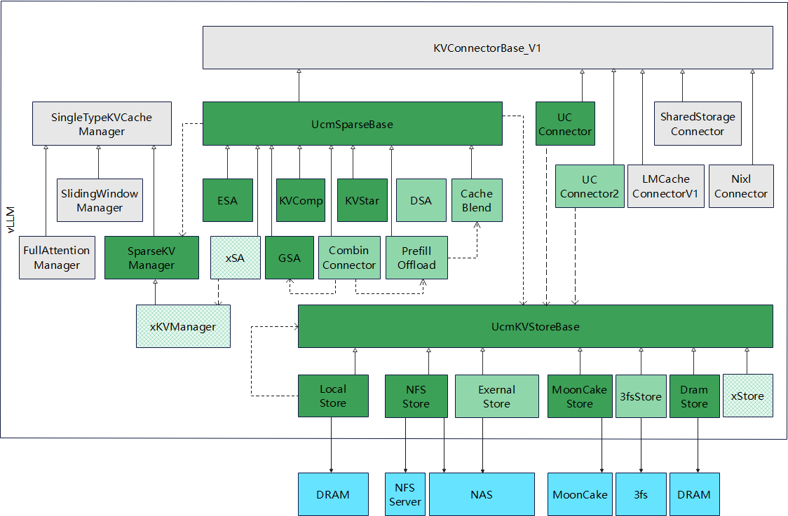

  <picture>
    <source media="(prefers-color-scheme: dark)" srcset="docs/source/logos/UCM-dark.png">
    
  </picture>

| <a href="https://ucm.readthedocs.io/en/latest"><b>文档</b></a> | <a href="README.md"><b>EN</b></a> |

---

## 概述

统一缓存管理器（Unified Cache Management, UCM）的核心原理是持久化 LLM 的 KVCache，并通过多种检索机制替代冗余计算。UCM 不仅支持前缀缓存（prefix cache, PC），还提供了多种无需训练的稀疏注意力检索方法，在处理极长序列推理任务时达到更高性能。此外，UCM 基于存算分离架构提供了 PD 分离方案，使得异构计算资源的管理更加简单灵活。与 vLLM 集成后，UCM 在多轮对话和长上下文推理等多种场景下可将推理延迟降低 3–10 倍。

---

## 动机

随着模型尺寸的不断增长，KV 缓存也变得越来越大，且越来越稀疏，对于长序列请求来说尤为明显。为了减小 GPU 显存的使用，主流的方向是将全量的 KV 数据卸载到外部存储中，而在 GPU 显存中只保留部分或者被压缩的 KV 数据。这同时可以减小 GPU 的运算量，在解码时增加最大生成序列长度和批大小。

有许多种不同的稀疏 KV 缓存的实现。最新的论文指出，能够最好地适配所有场景和所有模型的方法是不存在的。因此，更好的做法是搭建一套公共的框架，并在此之上接入不同的稀疏化算法，就像 KV 连接器和 PC 一样。

图中所有灰色框代表vLLM 0.9.2版本中的现有类，绿色框则代表UCM新增组件。浅绿色框展示了基于此框架未来规划扩展的子类。

UcmSparseBase是不同稀疏算法的基类。类似于KV连接器的设计，它将在scheduler和layer.py中的关键位置植入hook点，用于执行稀疏KVCache block的加载、转储和计算操作。

SparseKVManager允许用户针对不同算法自定义KVCache block的分配策略。为了将所有实现统一在SparseKVBase框架下，系统会调用SparseKVBase基类，而具体实现则由稀疏算法的子类完成。

KVStoreBase有助于实现稀疏算法与外部存储的解耦。它定义了与外部存储的通信方法，使得任何稀疏算法都能与任意外部存储系统无缝协作。其核心机制是通过ID和偏移量来标识数据块。这种方法不仅适用于稀疏场景，还能天然支持前缀缓存。KVStoreConnector将其与vLLM的KVConnectorBase_V1连接以提供前缀缓存功能。例如，NFSStore作为参考实现，提供了在单机本地文件系统或多服务器环境下通过NFS挂载点存储KVCache的能力。

---

## 支持特性
- 前缀匹配
- 缓存融合
- 模型窗口外推
- 预填充卸载
- 稀疏注意力
- 稀疏注意力卸载
- 异构PD分离

---

## 快速开始

请参考 [快速开始_vLLM](https://ucm.readthedocs.io/en/latest/getting-started/quickstart_vllm.html) 和 [快速开始_vLLM-Ascend](https://ucm.readthedocs.io/en/latest/getting-started/quickstart_vllm_ascend.html).

---

## 分支

| **分支**   |     状态   | vLLM 版本 | 
|-----------:|-----------:|-------------:|
|       main | 维护中 |       v0.17.0 | 
|    develop | 维护中 |       v0.17.0 |

---

