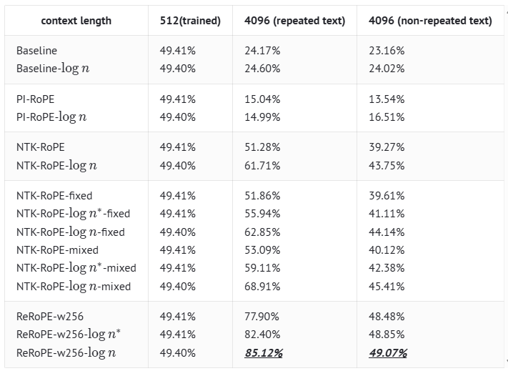

# Rectified Rotary Position Embeddings

Using Rectified Rotary Position Embeddings (ReRoPE), we can more effectively extend the context length of LLM without the need for fine-tuning. This is about the Triton implementation of ReRoPE and its integration into the vLLM inference framework.

<div align="center">

**🚀 ReRoPE | 📄 blog [https://kexue.fm/archives/9708] [https://normxu.github.io/Rethinking-Rotary-Position-Embedding-3]**


[](https://python.org)

</div>

## 🌟 What is ReRoPE? 

<div align="center">


</div>

This approach combines direct extrapolation with position interpolation. A window size $w$ is established, where a position interval of $1$ is used within the window, and an interval of $\frac{1}{k}$ is applied outside. As $k \to \infty$, this simplifies to the form illustrated above. Under this scheme, the position encoding range never exceeds $w$ regardless of input length, potentially enabling support for arbitrarily long contexts.

The attention score calculation formulas are as follows,

$$
\begin{aligned}
score_{ij}^{1} &= (q_iR_i)(k_jR_j)^T, && i-j<w \\
score_{ij}^{2} &= (q_iR_w)(k_j)^T, && i-j\ge w
\end{aligned}
$$

ReRoPE extends context length effectively but requires double attention—local within w and global compressed—significantly reducing throughput. Despite this overhead, it remains valuable for training-free long contexts, especially when combined with local attention windows to balance efficiency.

## 🧠 Triton ReRoPE Implementation

- Load Data

  Compared to the triton rope implementation, data loading requires passing query2 with alternative rotary embedding position and unrotated key2.

- Construct ReRoPE Mask

  During attention computation, the selection between attention score paths depends on the relative distance between query and key, necessitating construction of a rerope mask.

## 🏆 Results

<div align="center">

### The Experiment Results


The experiment is based on a hybrid Transformer-GAU (Gated Attention Unit) model with a size of 100M parameters. $logn$ indicates we add the scale factor $log n$⁡ at pretraining stage; $log n^{*}$ denotes we apply the scale factor to the attention matrix only for text exceeding the max sequence length, without any pretraining; $w256$ denotes the rerope windopw $w=256$.

</div>

## 🚀 Quick Start

### Installation

For installation instructions, please refer to the UCM's top-level README. Once UCM is installed, ReRoPE is naturally supported by running the following example scripts.

```bash
cd <path_to_your_vllm>
# Replace <version> with 0.9.2 or 0.11.0
git apply <path_to_ucm>/ucm/integration/vllm/patch/<version>/vllm-adapt-rerope.patch
export VLLM_ATTENTION_BACKEND=TRITON_ATTN_VLLM_V1
export VLLM_USE_REROPE=true
export ENABLE_UCM_PATCH=0
export DATA_DIR=/home/data/kv_cache
export MODEL_PATH=/home/models/Qwen2.5-14B-Instruct
export REROPE_WINDOW=32768
export TRAINING_LENGTH=32768
cd <path_to_ucm>
python examples/offline_inference_rerope.py
```

>Note: 
- `REROPE_WINDOW` and `TRAINING_LENGTH` are generally set to the model's pre-training length.
- For vLLM version 0.11.0, set `VLLM_ATTENTION_BACKEND` to `TRITON_ATTN`.

### Basic Usage

We need to modify the max_position_embeddings of the model according to the input length of prompts, as shown below.

```python
llm_args = EngineArgs(
        model=model,
        kv_transfer_config=ktc,
        hf_overrides={
            "max_position_embeddings": 327680,
        },
        gpu_memory_utilization=0.9,
        max_num_batched_tokens=8192,
        block_size=16,
        enforce_eager=True,
        tensor_parallel_size=2,
    )
```

## 📊 Supported Models

Qwen-based models now are available


## 🎓 Cite

```
@misc{rerope2023,
  title={Rectified Rotary Position Embeddings},
  author={Jianlin Su},
  year={2023},
  howpublished={\url{https://github.com/bojone/rerope}},
}
```