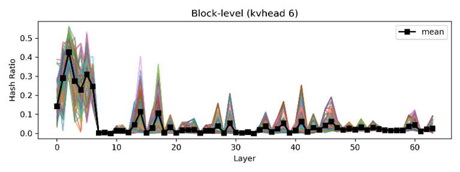
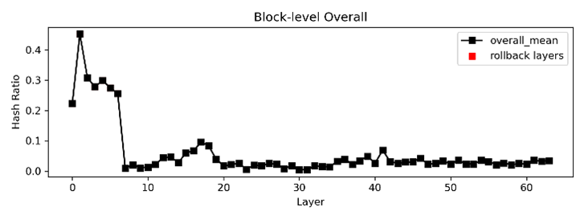
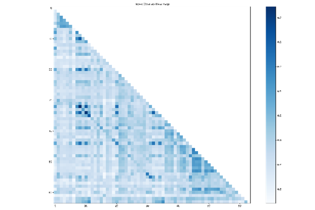
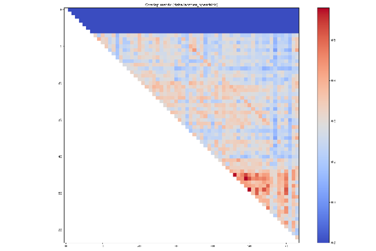
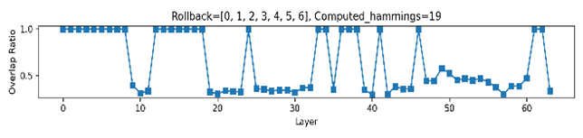

# 📘 Reuse-Aware Layer Skipping (RALS) Documentation

## I Project Objective 

RALS is a profiling tool designed to analyze the reusability of Transformer attention computations. Its primary goal is to identify:
1) which layers can safely skip redundant computation (skip layers); 
and
2) which layers must be recomputed to preserve model correctness (rollback layers), thereby reducing overall inference cost.

To achieve this, RALS analyzes：
- the sparsity of attention energy distributions, and
- the degree of attention overlap across different layers.

Based on these statistics, it automatically derives：
- rollback layers (layers that require full attention), and
- reuse paths for skip-layer execution（reuse path）

## II Overall Workflow

Load K/Q tensors  
↓  
Compute attention sparsity（hash ratio）  
↓  
Identify unstable layers（rollback layers）  
↓  
Compute inter-layer attention overlap matrices  
↓  
Search for the optimal reuse path  
↓  
Generate skip-layer execution configurations  

## III Detailed Explanation of Generated Figures

### One per KV head

**Meaning:**  
Layer-wise attention sparsity profiles.
 
**Figure components:**  
**X-axis:** Layer index (model depth)  
**Y-axis:** Hash Ratio — the proportion of attention blocks required to cover 90% of total attention energy  
**Light-colored curves:** distributions across individual decoding steps
Black bold curve: temporal mean over all steps

**Intuition of Hash Ratio:**  
**Small values (e.g., 0.1):** 90% of attention mass concentrates on a small number of tokens (high sparsity)  
**Large values (e.g., 0.8):** attention is widely spread, approaching global scanning
 

**What can be observed?**  
✔ Layers with highly concentrated attention (good candidates for reuse)  
✔ Layers with large temporal variance (unstable behavior)  
✔ Whether deeper layers tend to exhibit denser attention patterns

**Purpose:**   
Provides statistical evidence for identifying rollback layers.

### Aggregated across all heads

**Meaning:**  
Overall layer-wise attention sparsity after aggregating all KV heads. Used to determine layers with consistently low reusability that require recomputation

### Attention overlap heatmaps

 

**Meaning:**  
Inter-layer similarity of attention focus patterns.

**Each pixel represents:**  
The proportion of overlapping top-k attention blocks between Layer i and Layer j.

**Purpose:**  
✔ Identify layers with highly similar attention behaviors  
✔ Enable direct reuse of KV results between those layers

### Merged overlap matrix

**This figure merges overlap matrices across heads:**  
**MLA mode:** mean aggregation  
**Standard mode:** minimum aggregation (conservative estimate)

**Meaning:**  
The most reliable inter-layer attention reuse structure of the model.

**Purpose:**  
Serves as the input graph for the subsequent optimal reuse path search.

**Intuition:**  
It can be viewed as a “map” indicating which layers can safely skip computation by reusing results from earlier layers.

### Final skip strategy visualization

**Meaning:**  
Quality of the selected attention reuse path.  
**X-axis:** Layer index  
**Y-axis:** Overlap ratio

**Where:**  
**1.0** indicates direct computation  
**< 1.0** indicates reuse from previous layers

**Purpose:**  
Provides an intuitive visualization of:  
✔ Which layers are explicitly recomputed  
✔ Which layers are skipped via reuse  
✔ Whether reuse strength remains stable across the model

## IV Interpretation of the Final Output Configuration

**CONFIG 0:**  
[-1, -1, 1, 1, -1, 4, ...]

**Configuration Rules:**

| Value | Meaning |
|---------|----------|
| -1      | The layer is explicitly recomputed       |
| k      | The layer reuses the attention results from layer k       |

